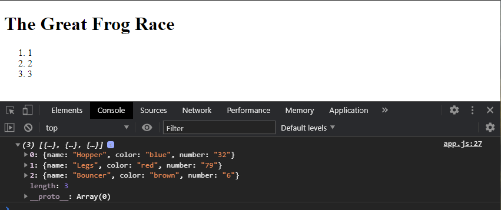
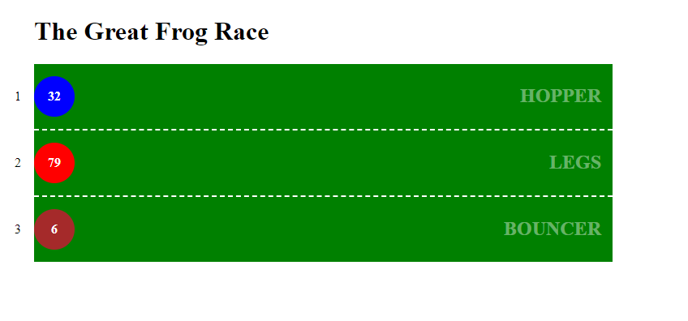
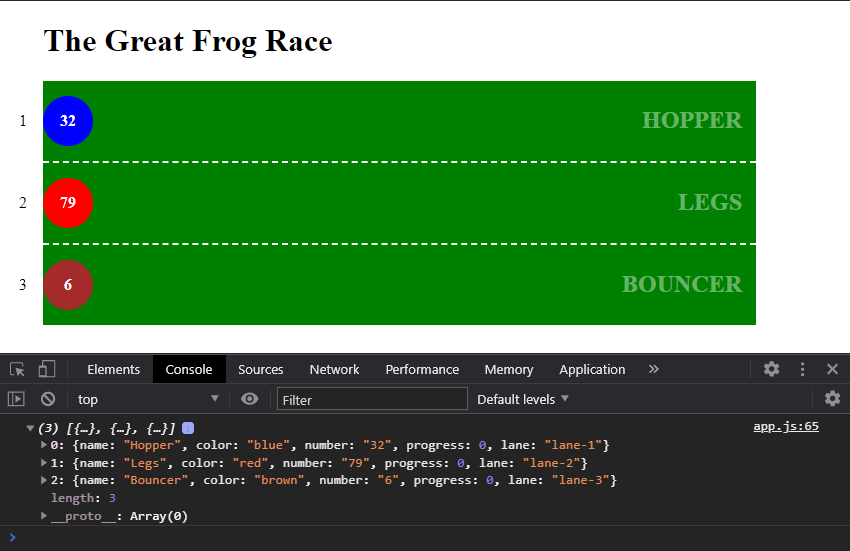
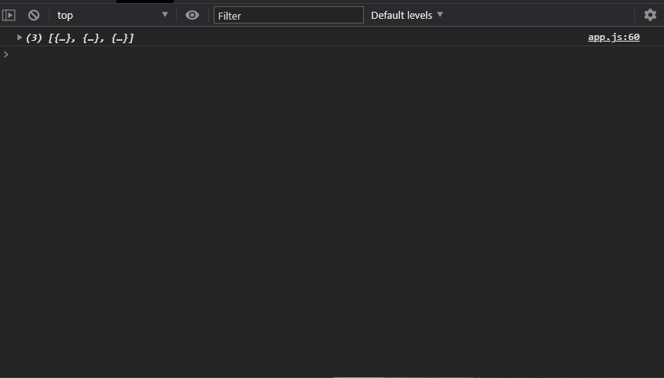
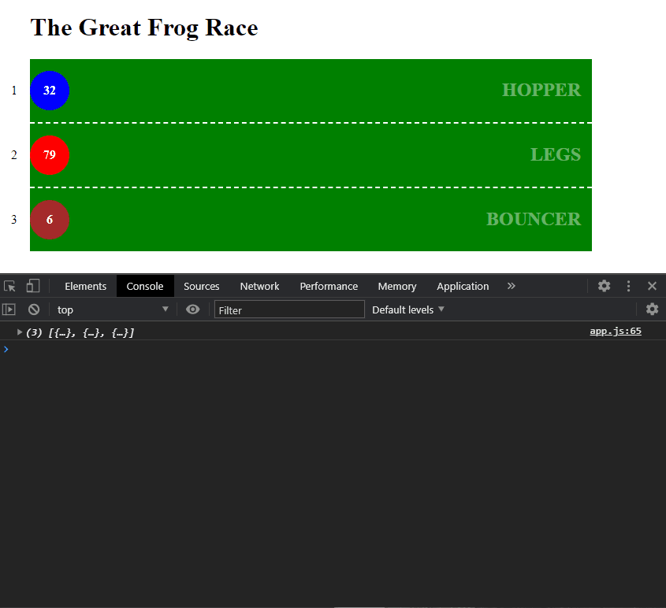

# JavaScript - The DOM - P2

## 🦊 Pre-lecture

⏲️ _not today._

---

## 🦉 Lecture

There is no new material today. We may go over some FUNdamentals in the morning. Come to class with your questions! :)

---

## Setup

```
yarn install
```

---

## ⚡ Exercises

### Exercise 1 - The Frog Race


By the end of this exercise, you will have a track, a stable of frogs that you can race, and everytime you load the page, frogs from the stable will race a predetermined distance. _Gambling is not condoned or encouraged._

All of the work will be done inside of `__workshop/exercise-1/` folder. Take a few minutes to see what's in there. \_You will write the majority of your code in `app.js`.

#### Exercise 1.1 - Set up the track

1. Write a `for` loop that will generate a "lane" for each frog. Each lane should be an `li` and inside each `li` there should be a span for the lane number. There is a variable called `FROGS` in `exercise-1/app.js`. Use that to determine how many times to run the `for` loop.
2. Each lane should be an `li`.
3. Inside each `li` there should be a `span` that contains the lane number.

We are going to need to target each lane separately at some point in our program. So let's give each lane its own `id` as well.

4. Assign each lane an `id` following the this pattern: `lane-<LANE_NUMBER>`. e.g. `lane-1`, `lane-2`, `lane-3`.
5. If you preview the page, you should now see an ordered list, with the lane number as its only value.

Here is some pseudo-code to get you started. 😎

```js
// Exercise 1.1 - Set up the track
for (let count = 1; count <= FROGS; count++) {
  // create a lane (<li>)
  // give lane an id
  // create a <span>
  // add the lane number to the span
  // append the span to the lane
  // append the lane to the track
}
```


#### Exercise 1.2 - Call in the frogs!

We need to add our stable of frogs to the app. You will find a file called `frogStable.js` in `exercise-1/assets/`.

1. Link that file in your `index.html` file. It should be added right _before_ the `app.js` file is added. This will allow the JS inside of `app.js` to have access to the contents of `frogStable.js`

```html
<script src="./assets/frogStable.js"></script>
```

2. Define an empty array called `racers`. Push the first 3 frogs from the stable into this array.
3. Write a `for` loop that keeps pushing frogs from `frogStable` into `racers` until we have the required number of frogs (as defined by `FROGS`).
4. Output the racers array to the console to make sure you actually have frogs in there.

```js
// Exercise 1.2 - Call in the frogs!
// declare a variable called racers and assign a value of: empty array

// write a for loop
// push a frog from frogStable into racers array

// console.log racers
```



#### Exercise 1.3 - Line 'em up!

We need to assign each frog to a lane.

1. Use the racers array to assign each frog to a lane.
2. Append the frog's name and racing number in the lane. (with a span)
3. Set the background color of the frog element to the color assigned to it in its object.

**HINT**: Use a `forEach` loop and make use of the optional callback argument `index`. More info on [W3 Schools](https://www.w3schools.com/jsref/jsref_foreach.asp).


#### Exercise 1.4 - Add Styling

1. Link the provided stylesheet (`/assets/styles.css`) in our `html` file.

```html
<link rel="stylesheet" href="./assets/styles.css" />
```

Revisit the loop you wrote in 1.3 and

2. add a class of `frog` to each of the frogs so that we can make use of the provided styling.
3. Move the frog name to its own `span`, and give that span a class of `frog-name`.



#### Exercise 1.5 - Track progress

We will soon need to track each frog's progress as they hop down the track. Let's use the `racers` array to do that.

Revisit the loop from 1.3 and

1. Set each frog's progress to 0 inside its object, inside of the racers array.
2. Set the frog's lane inside its object as well. (We'll need this later.)
3. Verify the console.log of `racers` to validate.



#### Exercise 1.6 - Make 'em hop!

1. Create a function called `racingFrog`. It will accept one parameter. This parameter will be a frog object from the racers array. _Put a console.log in there for testing purposes._

```js
const racingFrog = (racer) => {
  console.log("racingFrog() ", racer);
}
```

2. Write a `forEach` that will call `racingFrog()` for each frog in the `racers` array.


Let's get back to our racingFrog() function, and add some logic that will do the folowing every second:

3. calculate a random hop distance

```js
// Calculate the hop distance (as a percentage of the `trackWidth`) with the following formula.
const trackWidth = track.offsetWidth;
const hopLength = Math.floor(((Math.random() * 100) / trackWidth) * 100);
```

4. Declare a variable called `hop` and assign it a `setInterval`. This interval will add hopLength to `racer.progress` every second.
5. Move the `hopLength` declaration to the function inside the `setInterval`
6. Add that distance to the frog's progress (`racer.progress`)
7. Console for verification.

You should end up with something like this:

```js
const hop = setInterval(() => {
  const hopLength = Math.floor(((Math.random() * 100) / trackWidth) * 100);
  // add hopLength to progress
  // add a console log to verify
}, 1000);
```


Notice that this will continue forever!! 😬

8. Add logic to the `setInterval` callback to stop the frog hopping beyond a progress of `100`.
9. Once a frog reaches `100`, use `clearInterval` to stop the process.
10. Write a message to the console, once the frog has reached the end.



---

<center>🟡 - Minimally complete workshop (75%) - 🟡</center>

---

#### Exercise 1.7 - Hopping in the Browser!

Examine the CSS file and determine what property you can modify to get them moving on the screen. Once you know which CSS property to modify, modify it inside of the `setInterval` callback instead of the `console.log` that announces the bounce distance.



#### Exercise 1.8 - Uncooperative Frogs

If you have ever seen a frog race, it isn't all that exciting. The frogs are generally not that motivated to reach the end... To that end, let's give each frog its own random delay time for the setInterval to simulate a frog waiting around between hops.

---

<center>🟢 - Complete workshop (100%) - 🟢</center>

---

#### Exercise 1.9 - And the Winner is...

1. Create an array named `ranking`;
2. As soon as a frog reaches the end, push it into the array.
3. Once all of the frogs have finished, write a message to the console declaring the first, second and third place frogs (as applicable).

**Hint**: You will need to use `setInterval`...

#### Challenge 1

It would be great if we could pick frogs at random from the stable, instead of simply taking them in order. See what you can change to make this happen. You will most likely need to use a `while` loop instead of a `for` loop.

#### Challenge 2

The race needs some sprucing up. Make the game a more presentable! Flex those CSS muscles.

This could also include

- replace the beautiful circles with actual frog images.
- announcing the winner in the page.
- printing each frog's progress.
- a podium for the winners.
- etc.
